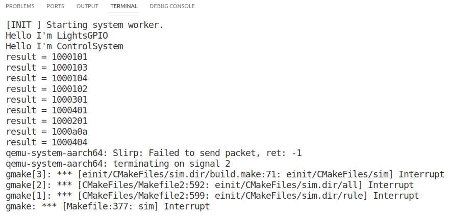
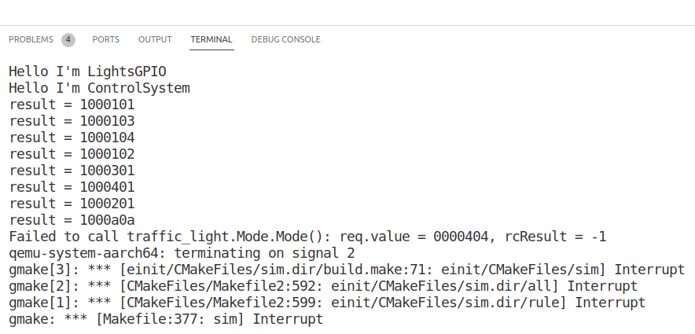
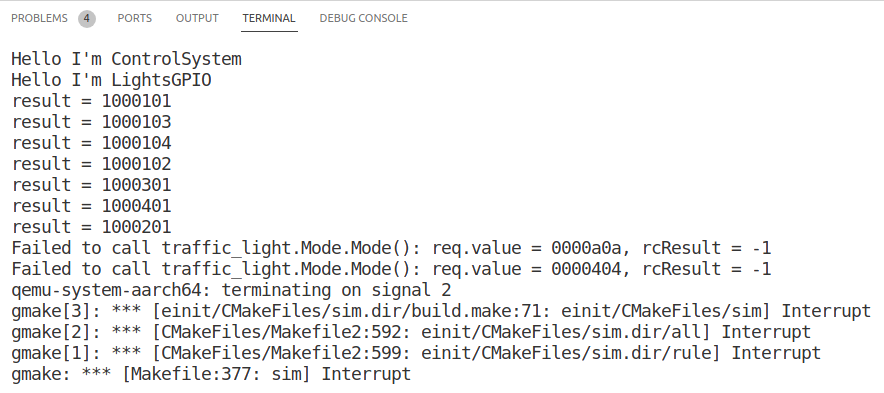

# Traffic lights control with KasperskyOS

## Описание задачи

### О примере

Функционально пример представляет из себя заготовку системы управления для светофора. Предлагается реализовать несколько сущностей, описанных в архитектуре системы, а также реализовать политики безопасности, которые обеспечат работу системы согласно политике архитектуры.

Цели и предположения безопасности обсуждаются на онлайн-курсе (ссылка будет добавлена позже). 


### Инструкция по настройке окружения для разработки


#### Настройка системы

Пошаговая видео-инструкция по развёртыванию KasperskyOS в виртуальной машине под управлением Oracle VirtualBox доступна в составе этого курса: https://stepik.org/course/73418

Использование KasperskyOS в docker контейнере описано на этой странице: https://support.kaspersky.ru/help/KCE/1.1/ru-RU/using_docker.htm

### Сборка и запуск примера

* с использованием Makefile:
  *  <b>сборка docker образа с KasperskyOS</b>. 
  В этом проекте в качестве базового образа используется Ubuntu 20.04, при желании можно поменять на Ubuntu 22.04 или Debian 10.12.
    
        ```make d-build```   

        <i>Примечание</i>: установочный deb файл с KasperskyOS Community Edition SDK должен быть скопирован в папку с Dockerfile (корневую папку проекта) перед запуском этой команды

        
  *  <b>запуск контейнера</b>

        ```make develop```

        Примечание: в контейнере предполагается работать не от имени root, а от пользователя user. 
        
        Если где-то это будет мешать, нужно в Makefile для цели develop убрать в команде запуска аргумент "--user user"

        

  * <b> сборка проекта</b>. Примечание: эта команда должна выполняться внутри контейнера

    ```make build``` 

  * <b> запуск в qemu</b>. Примечание: эта команда должна выполняться внутри контейнера

    ```make sim``` 

  *  <b> удаление временных файлов</b>. Сейчас удаляет папку build со всем содержимым. 

        ```make clean``` 
    
        Собранный образ с SDK можно удалить командой 

        ```docker rmi kos:1.1.1.40u20.04```


## Домашнее задание: День 1

Задание:

1. ✅ Сделать [fork](https://github.com/cherninkiy/cyberimmune-traffic-light) исходного [репозитория](https://github.com/cyberimmunity-edu/cyberimmune-systems-example-traffic-light-kos)

2. ✅ В своем репозитории изменить политики политики безопасности так, чтобы не допустить комбинации "два зеленых"

Результаты работы исходной версии архитектуры


Запрет комбинации "два зеленых" (rec.value == 404)


3. ✅ Изменить политики безопасности так, чтобы не допустить вариант «два зелёных» в сочетании с другими цветами. Сохранить изменения в репозитории

Запрет комбинации "два зеленых" в сочетании с другими цветами (режим мигания не считаем за цвет)


4. ✅ Отправить все свои изменения в свой репозиторий на github в
ветку [day1-homework](https://github.com/cherninkiy/cyberimmune-traffic-light/tree/day1-homework)